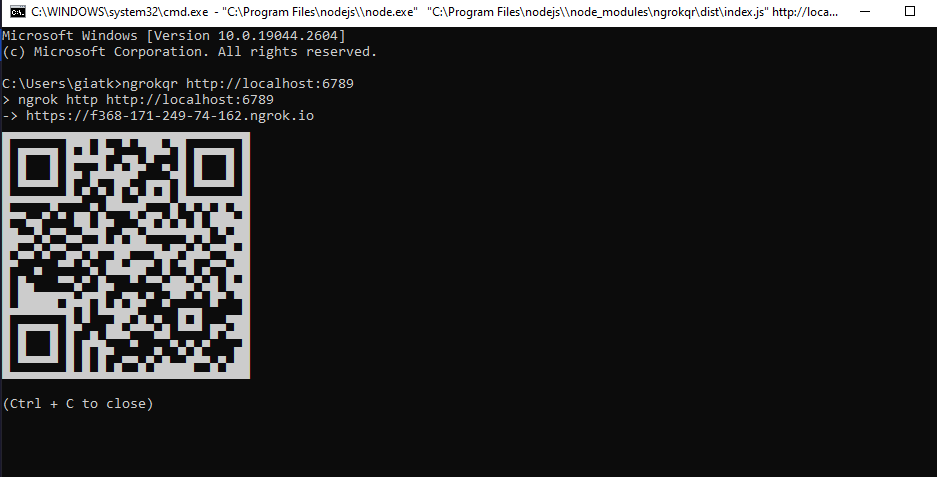

# Ngrok but have QR code

## Installation
Install package: `yarn`

Install cli: `npm install -g .`
## Add Auth Token
1. Login https://dashboard.ngrok.com/ and get auth token.

2. Add token to cli: `ngrokqr --authtoken <input_your_auth_token_here>`

3. View current auth token: `ngrokqr --config`
## Usage
```bash
ngrokqr <your_port_or_host>
```
This the same as `ngrok http <your_port_or_host>`

Example: 
```bash
ngrokqr http://localhost:6789
```

```bash
ngrokqr 6789
```

